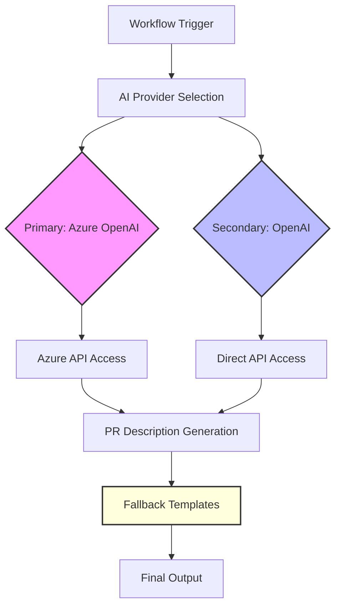
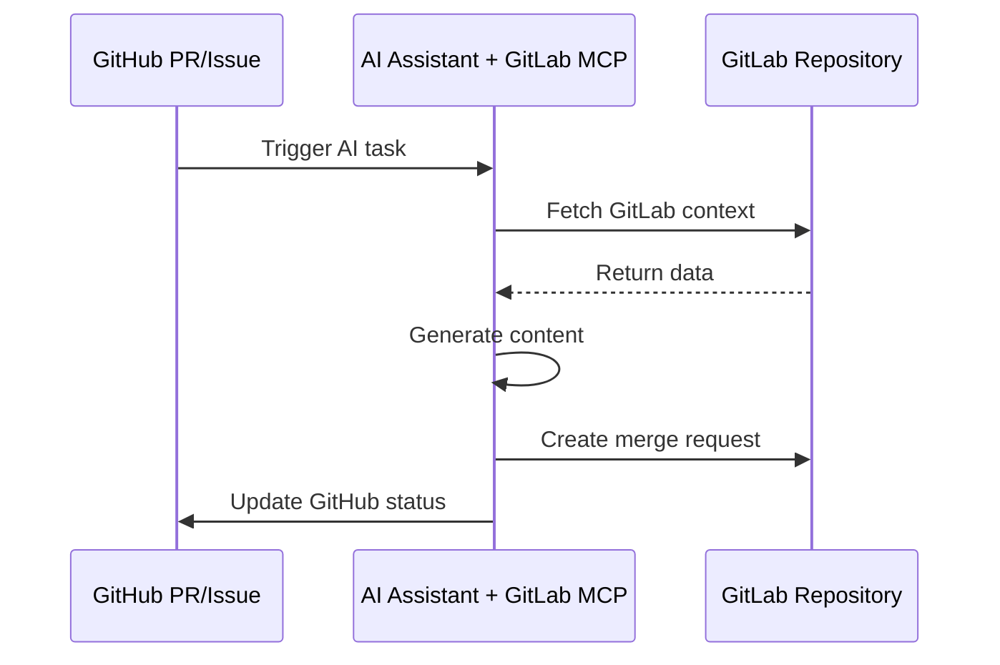
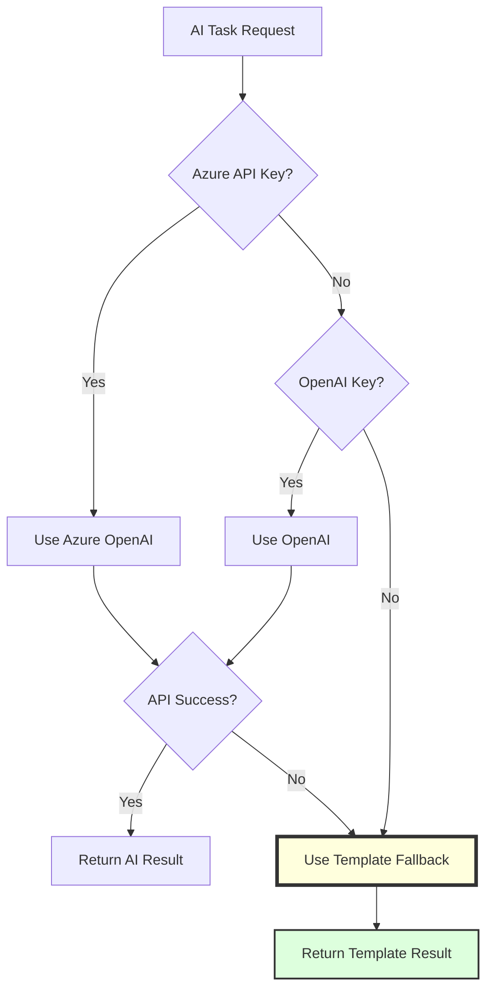
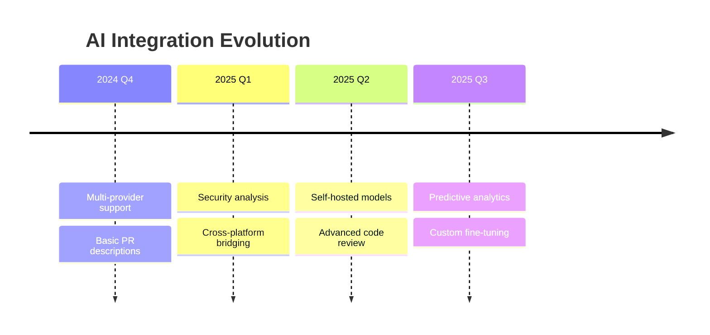

# AI Integration Architecture

The OSDU SPI Fork Management system incorporates sophisticated AI capabilities to enhance development workflows while maintaining reliability and cost-effectiveness. This integration provides intelligent analysis, automated documentation generation, and enhanced decision-making support throughout the fork management lifecycle.

## AI Integration Philosophy

<div class="grid cards" markdown>

-   :material-robot-outline:{ .lg .middle } **Enhancement, Not Dependency**

    ---

    AI capabilities enhance existing workflows without creating dependencies. All core functionality operates normally when AI services are unavailable, ensuring system reliability.

</div>

<div class="grid cards" markdown>

-   :material-swap-horizontal:{ .lg .middle } **Multi-Provider Architecture**

    ---

    Support for multiple AI providers prevents vendor lock-in and enables intelligent provider selection based on availability, cost, and capability requirements.

</div>

<div class="grid cards" markdown>

-   :material-shield-star:{ .lg .middle } **Secure by Design**

    ---

    API keys and sensitive data are handled through secure GitHub secrets management with proper access controls and audit trails.

</div>

<div class="grid cards" markdown>

-   :material-cash-multiple:{ .lg .middle } **Cost-Conscious Usage**

    ---

    Intelligent usage patterns, caching, and fallback strategies control API costs while maximizing value from AI capabilities.

</div>

## AI Provider Architecture



## Supported AI Providers

The system supports multiple AI providers with automatic detection and intelligent fallback:

| Provider | Priority | Integration Method | Key Capabilities | Typical Use Cases |
|----------|----------|-------------|---------------|---------------|
| :material-microsoft-azure: **Azure OpenAI** | Primary | Azure API + Enterprise features | Enterprise integration, compliance, GPT-4o access | Microsoft-aligned environments |
| :material-robot: **OpenAI** | Secondary | Direct API Access | Broad model selection, latest capabilities | General purpose AI tasks |
| :material-file-document: **Template Fallback** | Fallback | Structured templates | Consistent output, zero-cost operation | When AI unavailable or unsuitable |

## AI Enhancement Points

### Pull Request Descriptions

AI-generated PR descriptions provide comprehensive change analysis:

```yaml
# AI-powered PR description generation
- Change categorization (feat, fix, chore, etc.)
- Impact analysis
- Security vulnerability assessment
- Breaking change detection
- Review recommendations
```

### Commit Message Generation

Intelligent conventional commit messages from changesets:

```bash
# AI analyzes changes and generates conventional commit
# Input: Git diff
# Output: "feat(sync): add duplicate PR prevention logic"
```

### Security Analysis

AI-powered triage of vulnerability scans:

```yaml
# Trivy scan results → AI analysis → Actionable insights
- Vulnerability severity assessment
- Exploitation likelihood analysis
- Mitigation recommendations
- Priority ranking for remediation
```

## Implementation Patterns

### Provider Detection Logic

```bash
# Automatic provider selection based on available credentials
USE_LLM=false
LLM_MODEL=""

# Check for Azure OpenAI (Primary)
if [[ -n "$AZURE_API_KEY" ]] && [[ -n "$AZURE_API_BASE" ]]; then
  USE_LLM=true
  LLM_MODEL="azure/gpt-4o"
  echo "Using Azure OpenAI for AI tasks"

# Check for OpenAI (Secondary)
elif [[ -n "$OPENAI_API_KEY" ]]; then
  USE_LLM=true
  LLM_MODEL="gpt-4"
  echo "Using OpenAI for AI tasks"

# Fallback to templates
else
  echo "No AI provider configured - using templates"
fi
```

### Cross-Platform AI Integration

AI services bridge GitHub and GitLab operations through Model Context Protocol (MCP) servers:



## Cost Management Strategies

### Usage Optimization

```yaml
# Intelligent usage patterns to control costs
strategies:
  - Skip AI for small diffs (<100 lines)
  - Cache AI responses for similar patterns
  - Use fallback templates for routine operations
  - Batch API calls when possible
  - Set maximum token limits per request
```

### Monitoring and Limits

```bash
# Environment variables for cost control
MAX_DIFF_LINES=20000     # Skip AI for large diffs
AI_TIMEOUT=60s            # Prevent runaway requests
CACHE_DURATION=3600       # Cache responses for 1 hour
MONTHLY_LIMIT=10000       # API call budget
```

## Fallback Mechanisms

Robust fallback ensures workflow continuity:



## Security Considerations

### API Key Management

```yaml
# GitHub Secrets Configuration
secrets:
  AZURE_API_KEY:         # Azure OpenAI API key
  AZURE_API_BASE:        # Azure endpoint URL
  AZURE_API_VERSION:     # API version
  OPENAI_API_KEY:        # OpenAI API key

# Access Control
- Repository-level secrets
- Environment-specific configurations
- Audit logging for all AI API usage
- Rotation reminders via GitHub notifications
```

### Data Privacy

```yaml
# Data handling practices
- No sensitive data in AI prompts
- Sanitize repository contents before AI processing
- Use ephemeral environments for AI operations
- Clear AI context after each workflow run
```

## Performance Optimization

### Caching Strategy

```yaml
# Cache AI responses to reduce API calls
cache:
  key: "${{ github.repository }}-ai-${{ hashFiles('**/*.diff') }}"
  restore-keys: |
    ${{ github.repository }}-ai-
  path: .ai-cache/
```

### Parallel Processing

```yaml
# Run AI tasks in parallel where possible
jobs:
  ai-analysis:
    strategy:
      matrix:
        task: [pr-description, commit-message, security-triage]
    steps:
      - name: Run AI Task
        run: aipr ${{ matrix.task }}
```

## Future Enhancements

### Planned Capabilities

- **Self-hosted AI models** for sensitive environments
- **Fine-tuned models** for OSDU-specific tasks
- **Multi-modal analysis** for documentation and diagrams
- **Predictive conflict detection** using historical patterns
- **Automated code review** with context-aware suggestions

### Integration Roadmap



## Related Documentation

- [ADR-014: AI-Enhanced Development Workflow](../decisions/adr_014_ai_integration.md)
- [Workflow System Architecture](./workflow_system.md)
- [Security Architecture](./security.md)